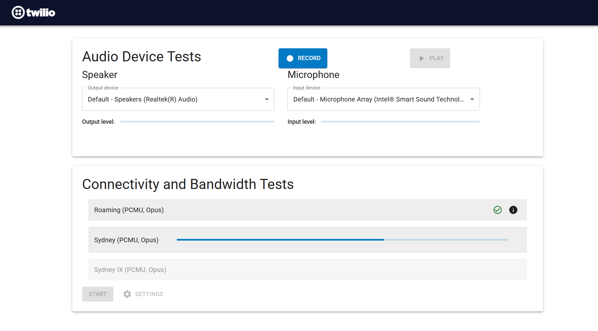
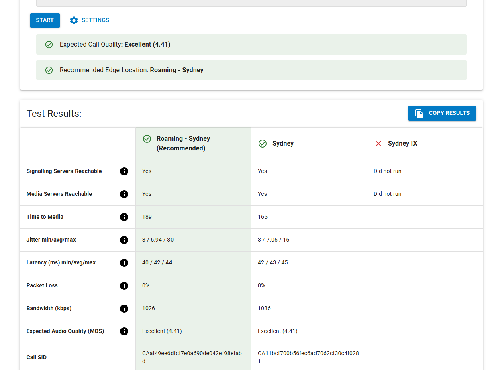

# Twilio Voice Diagnostics Tool

The Voice Diagnostics Tool provides connectivity and bandwidth requirements tests towards Twilio’s Programmable Voice servers and audio device tests to check browser VoIP calling readiness. It uses the [RTC Diagnostics SDK](https://github.com/twilio/rtc-diagnostics) and [Twilio Voice JS SDK](https://github.com/twilio/twilio-voice.js) to perform the tests.

This application uses Programmable Voice and Twilio NTS to perform the tests and will incur charges. See [Programmable Voice pricing](https://www.twilio.com/voice/pricing) and [NTS pricing](https://www.twilio.com/stun-turn/pricing).

## Features

- Bandwidth requirements tests
- VoIP quality measurements
- Support for testing towards all of Twilio Edge locations including Private Interconnect
- Side by side comparison of Edge locations connection results
- JSON formatted report
- Easy Copy of report to clipboard
- Interactive Mic testing
- Interactive Speaker tests

## Prerequisites

- A Twilio account. Sign up for free [here](https://www.twilio.com/try-twilio)
- Node.js v22+
- Yarn

## Install Dependencies

Run `yarn install` to install all dependencies.

## Deploy the App to Twilio

Before deploying the app, add your Twilio Account SID and Auth Token to the `.env` file (see `.env.example` for an example). The app is deployed to Twilio with a single command:

`$ yarn serverless:deploy`

This performs the following steps:

- Builds the React app in the `build/` directory and deploys it to Twilio Serverless.
- Deploys the end points required for performing the tests to Twilio Serverless. These include an access token generator, an NTS token generator, the TwiML App and corresponding TwiML bins

When deployment has finished, the Twilio Serverless URL for the application will be printed to the console. This URL can be used to access the application:

`Deployed to: https://rtc-diagnostics-12345-dev.twil.io`

## View App URL

To view the App URL, run the following command:

`$ yarn serverless:list`

This will display the URL at which the Application can be accessed.

## Local Development

In order to develop this app on your local machine, you will first need to deploy all needed endpoints to Twilio Serverless. To do this, complete the steps in the "Deploy the App to Twilio" section above.

Once the endpoints are deployed, add the app's URL to the `.env` file. Then you can start a local development server by running the following command:

`$ yarn start`

## Tests

Run `yarn test` to run all unit tests.

Run `yarn test:serverless` to run all unit and E2E tests on the Serverless scripts. This requires that your Twilio account credentials are stored in the `.env` file.

## Related

- [Twilio Voice JS SDK](https://github.com/twilio/twilio-voice.js)
- [Twilio RTC Diagnostics SDK](https://github.com/twilio/rtc-diagnostics)
- [Twilio Voice Client JS Quickstart](https://github.com/TwilioDevEd/client-quickstart-js)
- [Twilio Client connectivity requirements](https://www.twilio.com/docs/voice/client/javascript/voice-client-js-and-mobile-sdks-network-connectivity-requirements)

## License

See the [LICENSE](LICENSE) file for details.

## Screenshots

